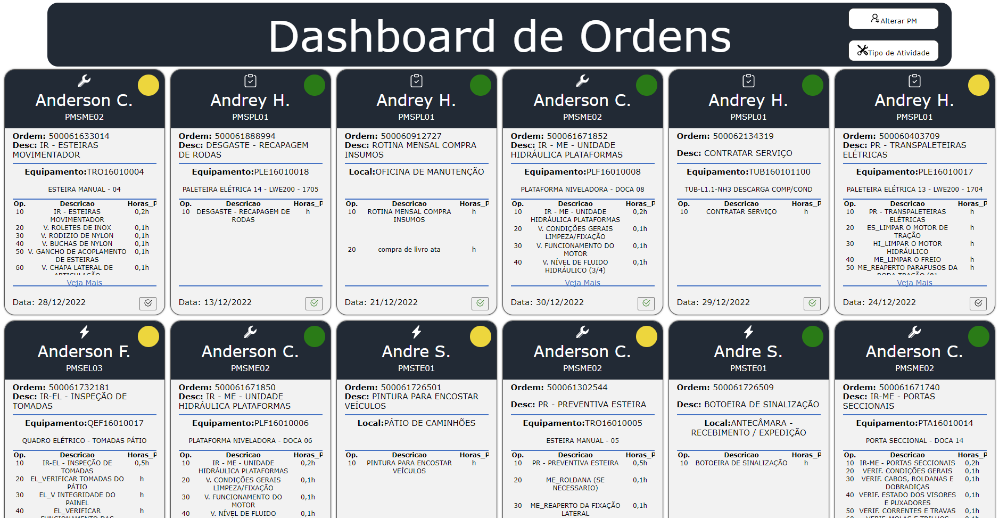
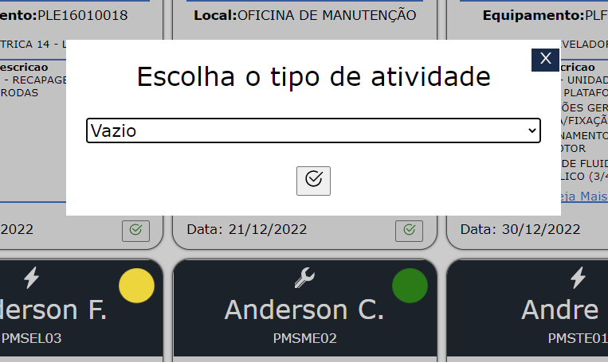
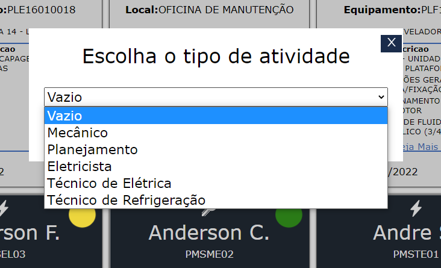
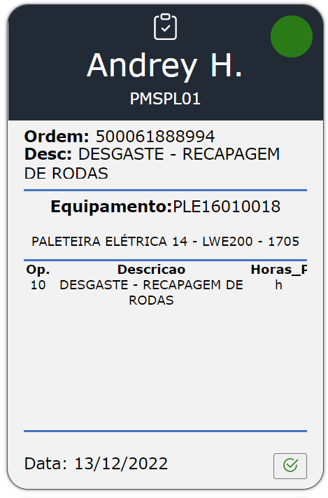
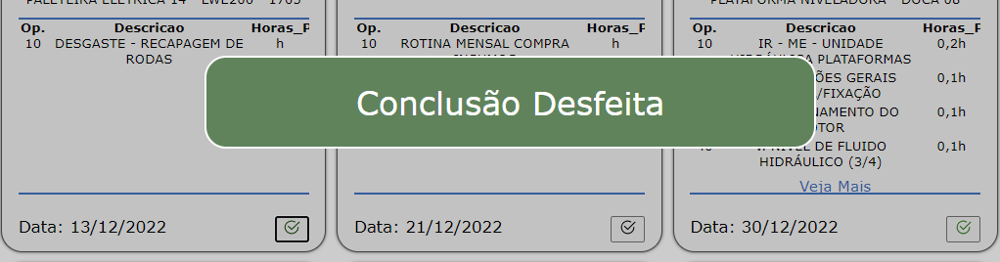

# DashBoard de Ordens

  

---

Este projeto está separado em três partes.

- 📥Comunicação com SAP
- 📤Integração com Banco de Dados
- 📊Layout para Usuário

---
## :rocket: Tecnologias

-  [VBA](https://learn.microsoft.com/pt-br/dotnet/visual-basic/)
-  [FireStore](https://firebase.google.com/docs/firestore?authuser=0&hl=pt)
-  [React](https://pt-br.reactjs.org/)
-  [React-Icons](https://react-icons.netlify.com/)

---
## Comunicação com SAP

### Linguagem: VBA

Nesta etapa é escolhida somente uma data de início e fim, e após isso roda-se uma macro para extrair um arquivo em Excel do SAP.

Após extraído pela macro, esses dados são colados na planinha principal.

Esses dados colados são colados em uma Tabela, e essa tabela está atrelada a base de uma Power Query. Isso pois através do Power Query torna-se muito mais fácil converter uma data de ponto, para uma data com barras já no padrão brasileiro.

Após essa primeira macro, é rodada uma segunda macro para concatenar todas as operações, descrições e tempo estimado para realizar de todas ordens que tiverem o mesmo número. Essa macro utiliza os dados da planilha do Power Query anterior e forma uma nova tabela com os dados concatenado.

Essa nova tabela também é convertida para um Power Query, para poder relacionar o Centro de trabalho(PM) com o nome do manutentor. Também nessa conversão é feita uma extração da função do manutentor, conforme a tabela abaixo

| Centro de trabalho | Função  |
| --- | --- |
| PMSEL01 | Eletricista |
| PMSME01 | Mecânico |
| PMSCI01 | Manutentor cívil  |
| PMSPL01 | Planejador |
| PMSTE01 | Técnico em Elétrica  |
| PMSTR01 | Técnico em Refrigeração  |
| PMSOP01 | Operador de refrigeração  |

Depois dessa implementação na tabela, roda-se uma terceira macro para exportar o arquivo concatenado em CSV UTF-8

Essa base em CSV está separada as linhas por um sinal de: **}**

As operações, descrições e tempos estimados são separados por um sinal de: **{**

E cada parâmetro do objeto ordem é separado pelo sinal de: **|**

---

## Integração com banco de dados

### 👨🏻‍💻Linguagem: Javascript

Após o csv estar pronto, foi utilizado o react para desenvolver uma página para importar o csv e integrar com o banco de dados em nuvem

O banco de dados utilizado foi o Firestore do Firebase, um banco de dados não relacional bem simples para a utilização, e o mais importante, é gratuito.

Ao receber o csv na página através de um input do tipo file, é separada toda a concatenação e implementado um array de objetos, onde cada posição do array contém um objeto ordem, esse objeto ordem possui as seguintes características:

Exemplo

| Key | Value |
| --- | --- |
| Ordem | 500061302540|
| Operacao | [10,20,30] |
|Descricao|[PR - PREVENTIVA ESTEIRA,ME_ROLDANA (SE NECESSARIO),ME_REAPERTO DA FIXAÇÃO LATERAL]|
|Equipamento|TRO16010001|
|Nome do Equipamento|ESTEIRA MANUAL - 01|
|Local de Instalação|ESTEIRAS TRANPORTADORA - MOVIFLEX|
|Horas previstas|[0.5,0.1,0.1]|
|Data|27/12/2022|
|PM Responsável|PMSME02|
|Classificação|ME|
|Nome do PM|Anderson C.|

Após essa separação, são enviados esses dados para o FireStore.

Também há nessa aplicação um botão para apagar todos os dados do banco. Caso seja necessário. E no caso de integração também é rodada a função para apagar antes de integrar.

---

## Layout para usuário

### 👨🏻‍💻Linguagem: Javascript

Assim como na etapa anterior, nessa também foi utilizado o react.

Para começar essa aplicação é necessário se comunicar com o banco de dados e coletar todas as ordens presentes no mesmo. Também é armazenado o ID do banco de dados, para futuras mudanças na aplicação.

Após receber os dados é montada a página através de cards, sendo cada card a representação de uma ordem.

Dentro da página há a função de filtrar pelo nome do manutentor, ou até mesmo pela função do manutentor.

|Botão filtrar por nome|Botão Filtrar por Tipo de atividade|
|---|---|
||| 

Ao apertar um dos botões, abre-se uma caixa com a opção de seleção, conforme o exemplo a seguir:

|Tela de seleção|Nomes disponíveis para seleção|
|---|---|
||| 

Dentro do card da ordem existe um botão de concluir a ordem, ao concluir, a bolinha ao lado do nome fica verde e é recebida uma mensagem ao usuário para entender o que foi feito.
|Imagem do card da ordem|Imagem de conclusão|
|---|---|
|||

Também ao concluir. É feito um edit no banco de dados através do ID dessa ordem.

Em cada card há uma imagem a cima do nome para identificar a classificação da atividade, conforme o exemplo abaixo 

| Classificação | Imagem  |
| --- | --- |
| Eletricista, Técnico em Elétrica ||
| Mecânico | |
| Manutentor cívil ||
| Planejador ||
| Técnico em Refrigeração,Operador de refrigeração | |
